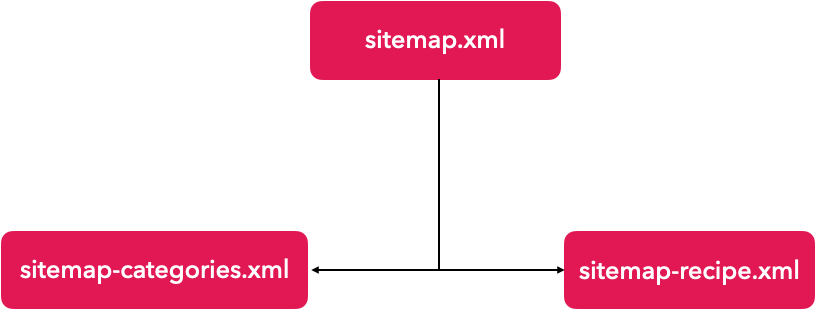

# gatsby-plugin-complex-sitemap-tree

Create a sitemap tree for your Gatsby site.

_NOTE: This plugin only generates output when run in `production` mode! To test your sitemap, run: `gatsby build && gatsby serve`_

> ℹ️ If you already installed [`gatsby-plugin-advanced-sitemap`](https://github.com/TryGhost/gatsby-plugin-advanced-sitemap), we have a [migration guide](docs/advanced-sitemap-migration.md)

## Install

`npm install gatsby-plugin-complex-sitemap-tree`

## How to Use

_(This is a base utilisation, all options are listed after)_

This plugin will allow you to create a sitemap tree to organize your urls.

Let's start with a simple exemple : We have a recipe site like [ChefClub](https://chefclub.tv) which means that we have a lot of `recipes` organized in `categories` and so, in our dataLayer, we have the two corresponding collections : `allRecipes` and `allCategories`

We want a sitemap tree like this :



So our config will look like this :
```javascript
// In your gatsby-config.js
siteMetadata: {
  siteUrl: `https://www.example.com`,
},
plugins: [
  {
    resolve : "gatsby-plugin-complex-sitemap-tree",
    options: {
      query: `
        MyRecipes : allRecipes {
            edges {
                node {
                    id
                    slug
                    last_comment_date
                    video_url
                }
            }
        }
        allCategories {
            edges {
                node {
                    id
                    slug
                    last_new_recipe
                }
            }
        }
      `,
      sitemapTree : {
        fileName: "sitemap.xml",
        children: [
          {
            fileName: "sitemap-categories.xml",
            queryName: "allCategories",
            serializer: (edge) => ({loc : edge.slug, lastmod : edge.last_new_recipe})
          },
          {
            fileName: "sitemap-recipes.xml",
            queryName: "MyRecipes",
            serializer: (edge) => ({loc : edge.slug, lastmod : edge.last_comment_date})
          },
        ],
      },
    },
  }
]
```

## Options

### Plugin options
| Required | Name | Description | Default | Example |
| --- | --- | --- | --- | --- |
|   | query | The GraphQL query to get information from the data layer  | `allSitePage { nodes { path } }` | See "Default" column |
| ✅| sitemapTree | The sitemap tree object (See [Sitemap tree options](#sitemap-tree-options) below) | | (See [Sitemap tree options](#sitemap-tree-options) below) |
|   | outputFolder | The output folder from the `public` folder   | ` ` | `sitemaps_folder` will export all sitemaps like this `public/sitemaps_folder/my-sitemap.xml` |
|   | entryLimitPerFile | The maximum number of entry in a sitemap file. Must be between 1 and 50 000. If there are too much urls the file will be split.| 45000 | |
|   | createLinkInHead | If true a `\<link>` to the root sitemap will be added to all your pages | `true` | `false` |
|   | xslPath | The path to the xsl file used to pimp your sitemap | | `sitemap.xsl` will take `public/sitemap.xsl` |


### Sitemap tree options
_⚠️ These options goes into the `sitemapTree` object of the plugin options._

The `sitemapTree` object is "recursive" : `children` contain other `sitemapTree` objects which form the tree at the end. There is no depth limit.

Each `sitemapTree` object leads to **one file** except in the case where the limit is exceeded, which splits the file.

| Required | Name | Description | Default | Example |
| --- | --- | --- | --- | --- |
| ✅| fileName | The name of the sitemap file. Should match with this regular expression`/.*\.xml$/` |  | `sitemap.xml` |
|   | outputFolder | The path to the output folder, from the parent one | ` ` | `recipes_sitemaps_folder` |
|   | xslPath | Override the [Plugin Option](#plugin-options) `xslPath` option | | `recipe-sitemap.xsl` |
|   | lastmod | Value of the `\<lastmod>` anchor next to the `\<loc>` one | | `2022-02-02` |
|   | children | Array of `sitemapTree` object | `[]` | |
|   | queryName | Name of the query from the [Plugin Option](#plugin-options) `query` option. _(⚠️ Needed if `serializer` is defined)_ |  | `MyRecipes` |
|   | serializer | Function that take the raw `queryName` results data and should return an object with at least a `loc` attribute. For more detail see [XML generation](#xml-generation). _(⚠️ Needed if `queryName` is defined)_ | |
|   | filterPages | Function that take the raw `queryName` results data and should `true` to keep this node or `false` to remove this node | | |
|   | xmlAnchorAttributes | Attributes to add `<?xml {here} ?>` | `version="1.0" encoding="UTF-8"` | |
|   | urlsetAnchorAttributes | Attributes to add `<urlset {here} >` | `xmlns="http://www.sitemaps.org/schemas/sitemap/0.9"` | `xmlns="http://www.sitemaps.org/schemas/sitemap/0.9" xmlns:image="http://www.google.com/schemas/sitemap-image/1.1" xmlns:video="http://www.google.com/schemas/sitemap-video/1.1"`|
|   | sitemapindexAnchorAttributes | Attributes to add `<sitemap {here} >` | `xmlns="http://www.sitemaps.org/schemas/sitemap/0.9"` | |

## Clarification
### XML generation
The `serializer` option should return an object with at least a `loc` attribute **but** can return a lot more.

For example we can return
```javascript
{
    loc : "/en-us/recipes/margherita",
    lastmod : "2022-02-02T12:00:00.000Z",
    "video:video" : {
        "video:thumbnail_loc" : "https://media.example.com/margherita.png",
        "video:title" : "Margherita",
        "video:content_loc" : "https://video.example.com/margherita.mp4",
    }
}
```
Which will generate the following xml
```xml
<loc>https://www.example.com</loc>
<lastmode>2022-02-02T12:00:00.000Z</lastmode>
<video:video>
    <video:thumbnail_loc>https://media.example.com/margherita.png</video:thumbnail_loc>
    <video:title>Margherita</video:title>
    <video:content_loc>https://video.example.com/margherita.mp4</video:content_loc>
</video:video>
```
As you can see, each attribute will be converted as an xml tag. If the attribute value is an object the algorithm will be recursive
